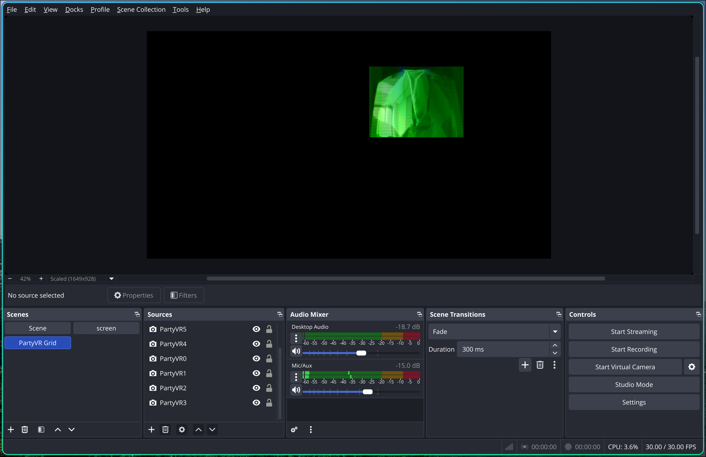

# Nick's Dotfiles (Arch Linux Rice)

Personal Hyprland + Waybar + shell setup for Arch Linux.

## Preview



## Included

- Hyprland: `.config/hypr/`
- Waybar: `.config/waybar/`
- i3 profile + scripts: `.config/i3/`
- Rofi/Wofi: `.config/rofi/`, `.config/wofi/`
- Notifications: `.config/dunst/`, `.config/mako/`
- Fish shell: `.config/fish/`
- Local helper scripts: `.local/bin/`
- Rofi theme asset: `.local/share/rofi/themes/`
- Wallpaper + media assets: `assets/`
- Package manifests: `packages/pacman.txt`, `packages/aur.txt`

## Install Dotfiles

Clone to `~/.dotfiles` (important: this path is used by Hyprpaper and `fkeys`):

```bash
git clone https://github.com/Nickdev8/dotfiles.git ~/.dotfiles
cd ~/.dotfiles
```

## Install Dependencies

```bash
cd ~/.dotfiles
sudo pacman -S --needed $(grep -vE '^(#|$)' packages/pacman.txt)
```

For AUR packages (with `paru`):

```bash
cd ~/.dotfiles
paru -S --needed $(grep -vE '^(#|$)' packages/aur.txt)
```

### Option A: Copy (simple)

```bash
mkdir -p ~/.config ~/.local
rsync -a --exclude 'fish_variables' .config/ ~/.config/
rsync -a .local/ ~/.local/
cp -a .bashrc .bash_profile .profile .Xresources .gtkrc-2.0 ~/
```

### Option B: GNU Stow

```bash
sudo pacman -S --needed stow
cd ~/.dotfiles
stow --target="$HOME" \
  --ignore='(\.git|README\.md|AGENTS\.md|packages|screenshots|assets|fish_variables$)' \
  .
```

## Required Services

```bash
sudo systemctl enable --now NetworkManager
sudo systemctl enable --now bluetooth
sudo systemctl enable --now power-profiles-daemon
systemctl --user enable --now pipewire pipewire-pulse wireplumber
```

## Fonts and Theme Requirements

- Font used in Waybar: `JetBrainsMono Nerd Font`
- Cursor theme expected by Hyprland: `Qogir-Light`
- GTK/Icon tools used: `nwg-look`, `arc-gtk-theme-eos`, `eos-qogir-icons`

## Post-Install Notes

- `hyprpaper` wallpaper is loaded from:
  - `~/.dotfiles/assets/wallpapers/background.jpg`
- F-key helper media is loaded from:
  - `~/.dotfiles/assets/fkeys/cinama.png`
  - `~/.dotfiles/assets/fkeys/vine-boom.mp3`
- Set Hackatime values if you enable the Waybar `custom/wakatime` module:

```fish
set -Ux HACKATIME_USER_ID "your_user_id"
set -Ux HACKATIME_API_KEY "your_api_key"
```

- Weather scripts in `.config/i3/scripts/openweather*` contain placeholders and must be customized.
- Optional Waybar modules (`wallchange`, `theme`, `wbar`, `power`) reference HyDE helper scripts that are not included in this repo and are currently disabled in `modules-right`.
- `fish_variables` is machine-specific. The copy command above excludes it on purpose.
- Some hardware-specific entries may need edits:
  - monitor descriptors in `.config/hypr/hyprland.conf`
  - backlight device in `.config/waybar/config.jsonc`
